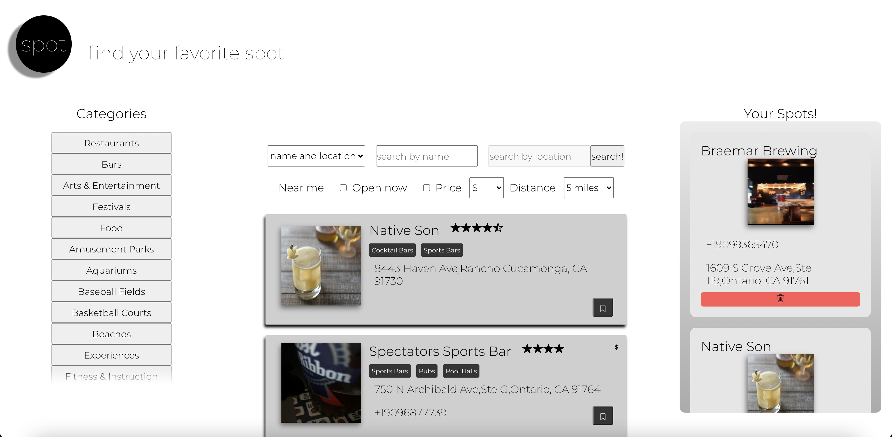
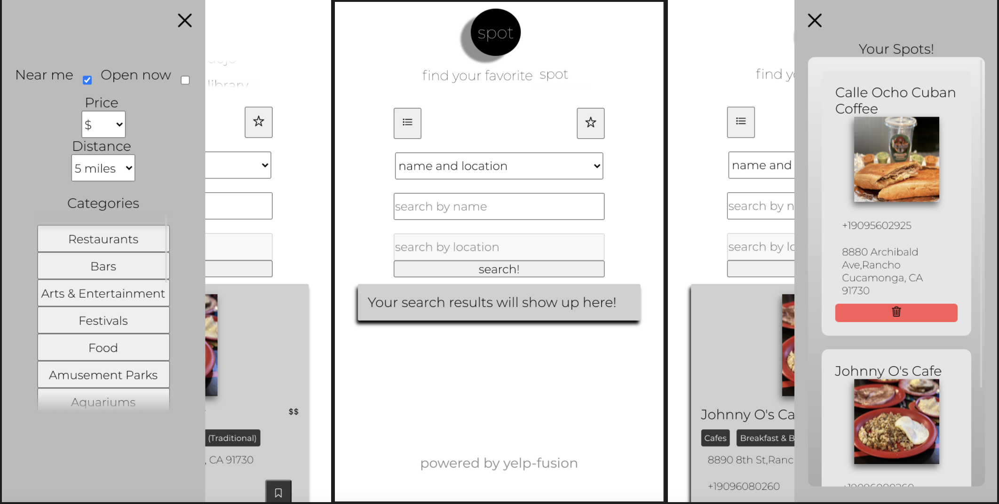

# ⚫⚪ Spot ⚫⚪

    This super cool application is pretty much a yelp clone (minus a few features). 
    Using the yelp-fusion package which utilizes the Yelp API, this app accesses 
    the Yelp database of businesses, restaurants, parks, etc. Yelp, yelp, yup!

## 🖱️ Tech and structure 💻

- This is a primarily front-end project, with a small back-end just for making requests to the Yelp API.

- Entirely coded in **vanilla CSS** as a practice project, spot is entirely responsive from 290px up. Who has a screen smaller than 320px anyway right?

- Built with **React**, the application utilizes common **React** hooks such as **useEffect** and **useState**, as well as **DOM document and window methods** like **MutationObserver** to manage state as efficiently as possible considering making requests to _not the fastest_ API.

- In a nutshell 🥜 : {**JavaScript, CSS, HTML, React**}

## 📈 Capability

With _**Spot**_ you can do quite a ✋full of things:

- When you open the site, _**Spot**_ will ask to use your location and initialize the near me filter option as checked.

- With near me checked you can search by category by clicking any category to the right. On smaller devices, the categories will collapse into a sidebar and a button will appear on the top left side of the search area.

- On very small devices (pretty much anything smaller than an iPad) the filters will also collapse into the same sidebar as the categories.

- On the right side of the screen, the favorites area is where you can save and delete your favorite spots. By clicking the bookmark icon on the search results, the business clicked will be pushed into the favorites area. The favorites area will also collapse into a sidebar on smaller screens, and a button on the top right side of the screen will appear.

- You can search by location and name of businesses or category, the 'name' input field can take categories and terms as well. The filters area can skew your search by businesses that are currently open, price, and distance from the location you're searching in.
